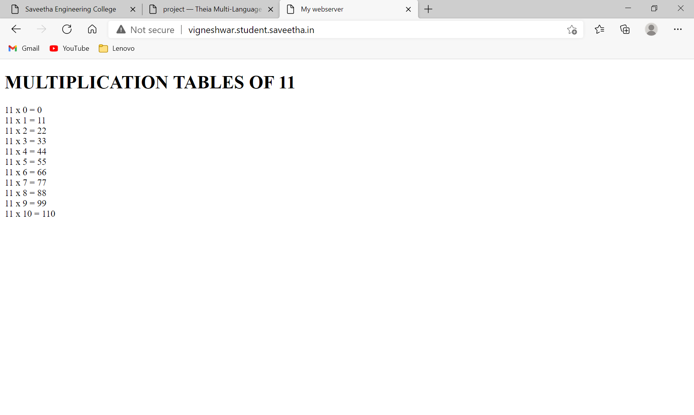

# Developing a Simple Webserver
## AIM:
To develop a simple webserver to serve html pages.

## DESIGN STEPS:
### Step 1: 
HTML content creation
### Step 2:
Design of webserver workflow
### Step 3:
Implementation using Python code
### Step 4:
Serving the HTML pages.
### Step 5:
Testing the webserver

## PROGRAM:
```
from http.server import HTTPServer , BaseHTTPRequestHandler

content =""" 
<!DOCTYPE html>
<html lang="en">
<head>
<title> My Webserver </title>
</head>
<body>
<h1> 11 TIMES TABLE </h1>
11 X 0 = 0 <br>
11 X 1 = 11 <br>
11 X 2 = 22 <br>
11 X 3 = 33 <br>
11 X 4 = 44 <br>
11 X 5 = 55 <br>
11 X 6 = 66 <br>
11 X 7 = 77 <br>
11 X 8 = 88 <br/>
</body>
</html>
"""
class Web(BaseHTTPRequestHandler):
    def do_GET(self):
        print("req recieved")

        #To create response header
        self.send_response(200)
        self.send_header('Content-type' , 'text/html; charset=utf-8')
        self.end_headers()

        #To send the response 
        self.wfile.write(content.encode())

#To create server address 
server_address=('',80)

#To create server object
httpd = HTTPServer( server_address , Web )

#To listen at the specified port
print(" MY webserver is running !!!")
httpd.serve_forever()
```
## OUTPUT:
'

## CODE VALIDATION REPORT:


## RESULT:
Thus a website is designed for the simple webserver and is hosted in the 
URL: http://vigneshwar.student.saveetha.in/  HTML code is validated.
